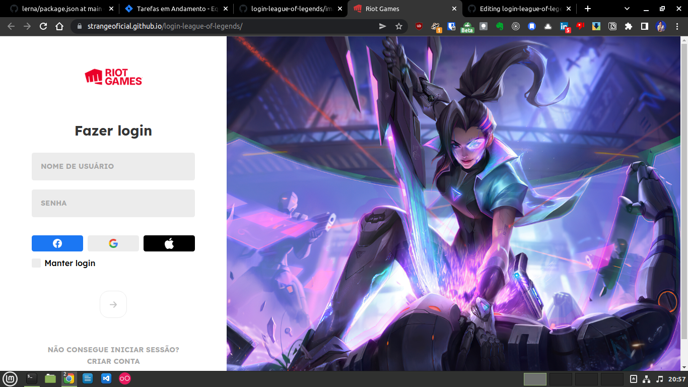

    
    <h1>Tela de Login do LOL</h1>
     
    

      Este é apenas um pequeno projeto bem simples, onde eu estou recriando a tela de login do jogo league of legends da empresa riot, uma pagina
      unica escrita em html, css e javascript.
    

 

